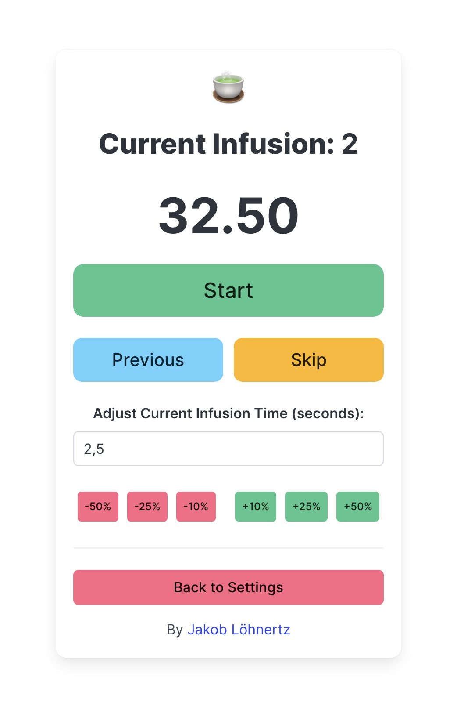

# 🍵 Gong Fu Tea Timer

A feature-rich progressive web application (PWA) to help you manage your Gong Fu tea sessions.
It allows you to track the time for each tea infusion, adjust the timer settings, and keep track of the current infusion
count.

> Gong Fu Cha (功夫茶) is a traditional Chinese tea brewing method that uses a high leaf-to-water ratio and short
> steeping times to extract the best and most nuanced flavors from the tea leaves and to enjoy the tea in multiple
> infusions which reveal different aspects of the tea's flavor profile over time.

#### Use the app [right in your web browser](https://loehnertz.github.io/gong-fu-tea-timer/).

## Features

- Responsive design that works well on both desktop and mobile devices.
- PWA support for installation on devices and subsequent offline use.
- Dark mode for low-light environments.
- Choose from predefined tea presets.
- Set custom initial infusion time and increment per infusion.
- Timer for each infusion with a countdown and progress bar.
- Audio alerts for the end of the infusion and five seconds before the end to get ready to pour.
- Adjust the timer just for the next infusion if the last one was too strong or too weak.
- Keeps the device awake during an infusion to prevent the timer from disappearing while the tea is brewing.
- Stores and loads settings and infusion count using local storage in case the app is closed during a session.

## Screenshot

## Getting Started

### Prerequisites

You will need a (somewhat modern) web browser to run this application.

### Running the App

Open `index.html` in your web browser.

Optionally, install the app on your device as a PWA by clicking on the "Install" button in the address bar or a similar
button in the browser's menu.

#### Alternatively, use the app [right in your web browser](https://loehnertz.github.io/gong-fu-tea-timer/), hosted on GitHub Pages.

### Built With

- [Vue.js](https://vuejs.org/) - The JavaScript framework used.
- [Bulma CSS](https://bulma.io/) - The CSS framework used.

### License

This project is licensed under the MIT License. See the [LICENSE](LICENSE) file for details.

### Acknowledgments

- [Mei Leaf](https://meileaf.com/) for the brewing times and being a great source of tea and the knowledge around it.
